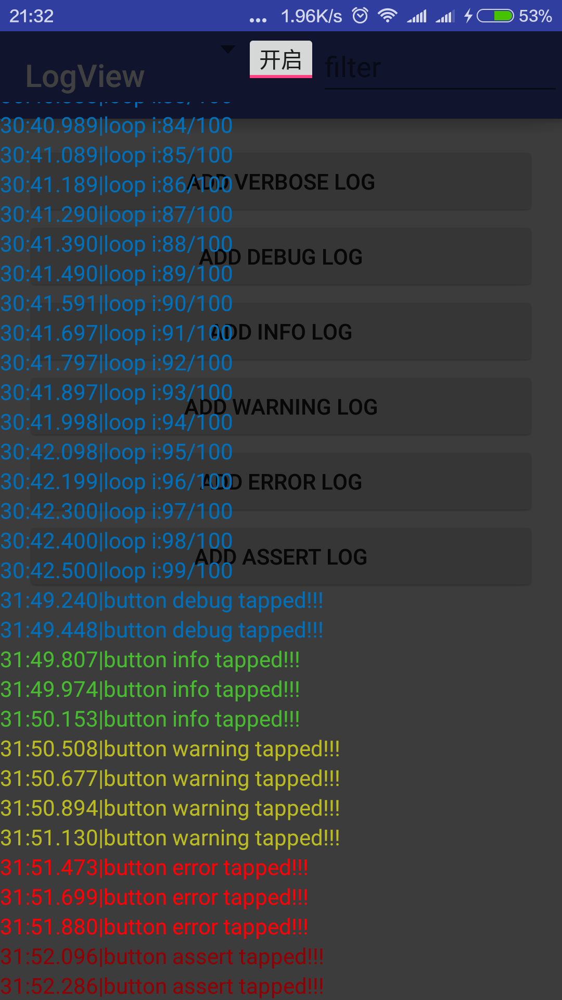
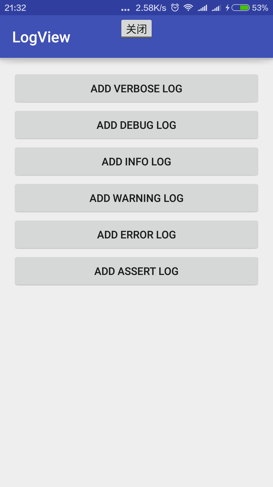

# LogView Ver.0.1.2

A Log View in Android.to make Tester check log without Developer.

<a href="./graphics/device-2016-05-08-213219.png"></a>
<a href="./graphics/device-2016-05-08-213232.png"></a>

# Instruction

1.Click log item to copy log to clipboard.

2.Click Toggle Button(in the top) to show/hide `logContainer`.

3.Use `LogViewApi.setEnable(false);` to unable LogView.(set it in your BaseApplication)

#Usage

1.Bind in Activity.

**use `bind()`method after `setContentView()`**.

```java
public class MainActivity extends AppCompatActivity {
    protected void onCreate(Bundle savedInstanceState) {
        ...
        setContentView(R.layout.activity_main);
        LogViewApi.bind(this);
        ...
    }
}
```

2.Use custom `Log` with LogViewApi.

```java
public class Log {
    public static void d(String tag, String msg) {
        android.util.Log.d(tag, msg);
        LogViewApi.d(tag, msg);
    }

    ...
}
```

3.Have fun.

# Proguard

```proguard
-keepclassmembers class com.fanhl.logview.LogViewApi {
   public *;
}
```

# TODO

1.scroll bar.

2.filter.

3.surfaceView or TextureView.

4.pined bottom.

5.change recyclerView to listView.

6.list divider.

7.custom logView(color,filter,etc.)

# License

Copyright 2016 dyguests

Licensed under the Apache License, Version 2.0 (the "License");
you may not use this file except in compliance with the License.
You may obtain a copy of the License at

   http://www.apache.org/licenses/LICENSE-2.0

Unless required by applicable law or agreed to in writing, software
distributed under the License is distributed on an "AS IS" BASIS,
WITHOUT WARRANTIES OR CONDITIONS OF ANY KIND, either express or implied.
See the License for the specific language governing permissions and
limitations under the License.